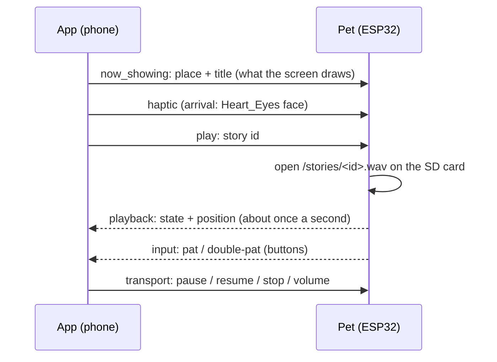

# Documentation

How Play it Forward works, how to use and build every part of it, why it's built the way it
is, and what we learned. Licence: CC BY 4.0 (see [LICENSE.md](../LICENSE.md)).

**Contents**

1. [The idea](#1-the-idea)
2. [How it works](#2-how-it-works)
3. [Guides](#3-guides): the app · the test tool · a showcase · adding stories · building the pet · using the pet · the pet screen lab · videos on the pet
4. [Design decisions](#4-design-decisions)
5. [Lessons learned and troubleshooting](#5-lessons-learned-and-troubleshooting)
6. [Status and what's next](#6-status-and-whats-next)
7. [All documents](#7-all-documents)

---

## 1. The idea

*We cross paths with thousands of people and hundreds of places every day, and know almost
nothing about any of them.*

Play it Forward is for people who travel the same Mumbai corridors every day. As they pass a
place, they hear a 40-second-or-so story about it: what was there before the road, what
happened there, what everyone walks past. It's **place-based**, not transport-based: near
Bandra, by train, bus or on foot, you hear about Bandra.

Principles that shaped every decision:

- **Quiet and specific, not playful-tech.** No gamification, streaks, points, badges, feeds,
  profiles, follows or comments.
- **A travel mode you switch on.** The web can't track location in the background, so the app
  says so plainly: start a journey, the screen stays on, stories come to you.
- **The pet is an accessory, not the product.** Most people won't have one, and iPhones can't
  pair with it (no Web Bluetooth on iOS). The app is complete on its own.
- **Mobile first, one-handed, readable in sunlight on a moving train.**

## 2. How it works

### The journey

1. **Start journey** is a deliberate tap. It unlocks audio (browsers block sound until the user
   taps), takes a screen wake lock, and starts location (`watchPosition`, high accuracy).
2. Every fix is checked against every story (`src/trigger/trigger.ts`): haversine distance to
   the story's point, inside its `radius_m`.
3. A story fires **once per journey**, the **nearest** one wins, and it needs **two
   consecutive fixes inside the radius**, or one fix whose accuracy is better than the radius.
   On a moving train a single bad fix could otherwise fire a story a kilometre early.
4. It plays on the phone, or on the pet if one is paired. If the pet doesn't have the file, the
   phone plays it instead.
5. Simulation (`src/position/simulate.ts`) feeds the trigger the same way as GPS, so changing
   source is one line, and the whole thing can be built and demonstrated indoors.

### The pet



- **Bluetooth LE**, the pet as the peripheral; the browser is the central (Web Bluetooth, Chrome
  on Android or desktop). Byte layouts: [PET-PROTOCOL.md](../Code/pif-webapp/docs/PET-PROTOCOL.md).
- **Audio never crosses the link** (the pet has its own copies on the SD card) and **the pet
  never gets coordinates** (it's told what to do, not where it is).
- Pairing retries and reconnects by itself if the link drops.
- The pet's screen shows a **face** between stories (seven moods: Normal with blinks,
  Heart_Eyes on arrival or a pat, Sad on a disconnect or a missing file, Bored, Sleepy, then
  off) and a **story screen** while playing (place, title, progress).

### The tools

- **`/debug`**: the testing tool (simulated rides, showcase setup, pet test panel, a simulated pet
  screen that mirrors the firmware).
- **`/lab`** and **`/media`**: pet tools that talk to the pet over **USB** (Web Serial, 921600
  baud), not Bluetooth, which is far too slow for pictures. See guides 3.7 and 3.8.

Module by module, with every contract: [ARCHITECTURE.md](../Code/pif-webapp/docs/ARCHITECTURE.md).

---

## 3. Guides

### 3.1 The app (`/`)

1. Open the app on a phone (HTTPS), and allow location.
2. **Start journey.** The top card shows where you are; story places are pins on the map.
3. When you reach a place, its story starts. The sheet shows the place, title and progress,
   with **Pause**, **Skip** and **Read** (the full text and its source).
4. **End journey** when you're done. Theme (auto, light, dark) and pet pairing are top right.

To run it yourself: `cd Code/pif-webapp && npm install && npm run dev:phone`, then open
`https://<laptop-ip>:5173` on a phone on the same Wi-Fi (accept the self-signed certificate
once). For a real deployment, `npm run build` and put `dist/` on any static HTTPS host.

### 3.2 The test tool (`/debug`)

- **Simulated rides** along demo routes (a walk over the Mahim causeway and two train lines),
  with a choice of speeds, also changeable mid-ride, plus real GPS.
- **Showcase places** (guide 3.3).
- **Pair a pet** (a real one over Bluetooth, or the in-browser fake pet) and **Test the pet**:
  play any story on it, pause/resume/stop, see where it's playing (on the pet, on the phone, or
  text only), the pet's button presses, and optionally its screen showing your GPS position.
- **Simulated pet screen**: the pet's 320×240 screen in the browser, with the same moods and
  layouts as the firmware.

### 3.3 Running a showcase

For a demo venue: make the stories' places be spots in the room or building, and walk it as a
real GPS journey.

1. In `/debug`, under **Showcase places**, stand at a spot and tap **Mark here**. The app
   averages 8 seconds of GPS and saves that spot with a 10, 15, 25 or 40 m radius (on this
   device only).
2. Repeat for each story. It warns when two circles overlap or a mark was less accurate than its
   radius.
3. Rehearse with the **Walk: through the showcase places** simulated route.

Indoors, phone GPS is often only good to 10–50 m: keep spots 50 m or more apart, ideally
outdoors or near windows.

### 3.4 Adding stories

Each story is an entry in `Code/pif-webapp/src/data/stories.json`:

```json
{
  "id": "dadar-mill-01",
  "place": "Dadar",
  "title": "The mills that were here first",
  "lat": 19.0186, "lng": 72.8440, "radius_m": 350,
  "segment": "central-01",
  "text": "the full text, shown under Read",
  "audio": "dadar-mill-01.mp3",
  "icon_id": 7,
  "duration_s": 41,
  "source": "https://… (required for anything factual)",
  "approved": true
}
```

- **Audio for the app:** `public/audio/<id>.mp3`. Without it, the story shows as text for
  `duration_s`.
- **Audio for the pet:** the same recording as WAV in `/stories/<id>.wav` on its SD card:
  `ffmpeg -i <id>.mp3 -ac 1 -ar 22050 -c:a pcm_s16le <id>.wav` (16-bit; 24-bit and 32-bit float
  WAVs won't play).
- The stories in this repository are **placeholders** (`approved: false`); their recordings
  aren't published.

### 3.5 Building the pet

Parts: [BOM.csv](../BOM.csv). Wiring: [Electronics/README.md](../Electronics/README.md).

1. **Arduino IDE** with the ESP32 boards package. Board **ESP32 Wrover Module** (it turns on
   PSRAM), Partition Scheme **Huge APP**, flash 4 MB.
2. **Libraries:** from the Library Manager, NimBLE-Arduino, Adafruit ST7735 and ST7789 (with
   Adafruit GFX) and JPEGDEC; from GitHub (download the ZIP, unzip into
   `Documents/Arduino/libraries`, drop the `-main` from the folder name),
   [arduino-audio-tools](https://github.com/pschatzmann/arduino-audio-tools) and
   [arduino-audio-driver](https://github.com/pschatzmann/arduino-audio-driver).
3. **Bring it up one piece at a time**, as we did: Bluetooth test → speaker → display → keys →
   the full story player. Each step is a sketch in `firmware/` and a section in
   [firmware/README.md](../Code/pif-webapp/firmware/README.md).
4. **SD card:** FAT32; DIP switches **1 OFF, 2 ON, 3 ON, 4 OFF, 5 OFF**; story WAVs in
   `stories/`, videos in `media/`.
5. Upload `firmware/pet_story_player`. If the upload times out, hold **BOOT** while it says
   "Connecting…".

### 3.6 Using the pet

**Buttons**

| Button | Tap | Double-tap | Hold |
|---|---|---|---|
| KEY1 (power) | wakes it (while asleep) | | 2 s: sleep |
| KEY3 (story) | pause / play | skip | replay the last story |
| MTDI (volume) | volume up | | volume down, repeating |

With the phone connected, KEY3's tap and double-tap go to the app (as a pat and double-pat), so
the app stays in charge of the journey.

**Serial Monitor** (Arduino IDE, **921600** baud, line ending **Newline**): type `help`.

| Command | Does |
|---|---|
| `ls` | what's on the SD card (stories and videos) and how full it is |
| `play <id>` · `pause` · `resume` · `stop` | stories |
| `media play <name>` · `media stop` · `media loop on/off` · `media fps <n>` · `media offset <ms>` · `media rotate <0-3>` | videos |
| `+` · `-` · `vol 0.9` | volume (0.9 is the loudest without distortion) |
| `mood 0`–`mood 6` | show a face for 5 s |
| `screen` | restart the screen if it goes white |
| `s` | status |

### 3.7 The pet screen lab (`/lab`)

Chrome or Edge on a computer, pet on USB, Arduino Serial Monitor closed.

1. **Connect the pet (USB)** and pick the board's COM port (the one the Arduino IDE uses; not a
   "Bluetooth" port). The lab asks the pet, restarts it if needed, and if that fails asks you to
   press RST.
2. **Screens**: draft designs for every pet screen (Startup, Waiting, Idle, Arrival, Now
   playing, Paused, Volume, Not on card, Sleeping, Blank), portrait 240×320, drawn with the pet's
   own Adafruit fonts so they match the firmware pixel for pixel. Edit the place, title, progress,
   volume and so on.
3. **Layers**: your own pictures (several at once = an animation; white background removable) and
   text in the pet's fonts, dragged into place on the preview.
4. **Live on the pet**: everything shows on the real screen within a second (only changed pixels
   are sent). Good for stills and layout.
5. **Clip: play it on the pet**: for anything that moves. Pick a stretch of the timeline, frames
   per second, loop / once / back-and-forth, optional sound (trim, sync offset, sample rate,
   volume) and colour depth; **Send & play** puts it in the pet's memory and the pet plays it
   itself, reporting how long each frame takes to draw.
6. **Link and display**: USB speed (falls back by itself if the board can't keep up) and the
   display's SPI speed.

### 3.8 Videos on the pet (`/media`)

The pet plays **MJPEG + WAV** from `media/` on its SD card: `<name>.mjpeg` (JPEG pictures back to
back), `<name>.wav` (16-bit PCM, optional) and `<name>.cfg` (fps, rotation, position, loop, sync;
optional). The video loads into the pet's PSRAM (up to about 3.5 MB), the sound streams from the
card, and the sound is the clock: frames that fall behind are skipped, so picture and sound stay
together.

Three ways to make and play them:

- **The dashboard** (`/media`): connect, **Add a video or animation** (a video, or several
  pictures), set width, fps, quality, trim, sound and orientation, **Convert**, then **Put on the
  pet and play** (over USB) or **Download** (for a card reader). **On the card** lists and plays
  what's there, with live loop, speed, sync and volume, and how well the pet is keeping up.
- **The script**: `node scripts/make-media.mjs "video.mp4" myname --loop` (needs ffmpeg) writes the
  files to `firmware/sd-card/media/`; copy them to `media/` on the card. Options: `--fps`,
  `--width`, `--fill`, `--quality`, `--from`, `--to`, `--sideways`.
- **ffmpeg by hand**:

  ```sh
  ffmpeg -i video.mp4 -an -vf "fps=15,scale=240:-2" -pix_fmt yuvj420p -q:v 7 -f mjpeg myname.mjpeg
  ffmpeg -i video.mp4 -vn -ac 1 -ar 22050 -c:a pcm_s16le myname.wav
  ```

Then `media play myname` in the Serial Monitor, or **▶ Play** in the dashboard.
`firmware/sd-card/media/sync-test` (a counting pattern with a beep every second) checks sound sync.

---

## 4. Design decisions

The full log, with dates: [ARCHITECTURE.md section 10](../Code/pif-webapp/docs/ARCHITECTURE.md#10-decisions-log).
The ones that shaped the project most:

| Decision | Why |
|---|---|
| A web app (PWA), no backend | Fastest to build and share; stories and audio are bundled. A native port is planned and documented ([ARCHITECTURE.md section 6](../Code/pif-webapp/docs/ARCHITECTURE.md#6-porting-to-a-native-app)). |
| Place-based triggers, two-fix rule, once per journey | Hear what you pass, whatever the transport; never early on a bad fix. |
| Simulation as a first-class feature | Develop and demonstrate indoors; the trigger logic can't tell the difference. |
| Leaflet + OpenStreetMap | Free, no API key, good rail and road data for Mumbai. |
| The phone decides; the pet gets ids | Works for every user, simple firmware, tiny Bluetooth messages. |
| WAVs on the pet's own SD card | No audio over Bluetooth; a missing file falls back to the phone. |
| Display on its own SPI bus | Sharing the SD card's bus made the card unreadable. |
| MJPEG + WAV for video | Full colour, small files, the sound as the clock; what ESP32 screens usually use. |
| Pet tools over USB, inside the web app | Design on the real screen without reflashing; Bluetooth is too slow for pictures. |

## 5. Lessons learned and troubleshooting

Most of these cost us hours; the full list is in [HARDWARE.md](../Code/pif-webapp/HARDWARE.md).

| Symptom | Cause | Fix |
|---|---|---|
| No COM port at all | Charge-only USB cable | A data cable |
| Board silent though the log looks healthy | Wrong codec board version, or no volume set | `AudioKitEs8388V1` (not V2) and `setVolume()` |
| Sketch hangs before `setup()` | PSRAM on with the "ESP32 Dev Module" profile | Use **ESP32 Wrover Module** |
| Speaker quiet / distorted | Volume 0.7 is −10 dB; 1.0 is +4.5 dB | 0.9 |
| WAV plays for a second or "0 s" | 24-bit or extra chunks from an audio editor | Convert with ffmpeg to 16-bit PCM |
| Display stays black with DC on GPIO 19 | GPIO 19 is wired to an onboard key | DC on 22 |
| SD card won't mount or read | Display sharing its lines, DIP switches, or no card | Display on its own bus; DIP 1 OFF, 2 ON, 3 ON, 4 OFF, 5 OFF |
| Board won't boot with the volume button | GPIO 12 sets flash voltage at boot | Button to 3.3 V (pulled down), not to GND |
| Colours look like a negative | Panel colour inversion | Flip `invertDisplay()` in `pet_screen.h` |
| "GATT Server is disconnected" in the app | The link drops right after connecting | Retry and auto-reconnect (built in) |
| Lab: "nothing came from that port" | A Bluetooth COM port was picked | Pick the board's USB port (CH340/CP210x) |
| Lab: the pet doesn't answer after connecting | The restart left the board stuck | The lab now tries no restart, a restart, the other line setting, then asks for RST |
| Videos sent frame by frame look like a slideshow | USB serial is ~90 KB/s; a full frame is 150 KB | Store on the pet (clips in PSRAM, or MJPEG on the SD card) |

## 6. Status and what's next

Working: the app end to end (real GPS and simulation, map, stories, pairing with reconnect); the
pet playing stories from its card on the app's command, its face and moods, three buttons and
sleep; the pet screen lab with live mirroring; the media dashboard.

Next:

- [ ] Real stories: text, recordings and sources, approved
- [ ] Try MJPEG video with sound on the board, and tune sync
- [ ] Port the chosen portrait designs from the lab to `pet_screen.h`
- [ ] Battery and a power switch; runtime test
- [ ] An enclosure (CAD)
- [ ] Remembering heard stories and revealing the map as you travel ([FEATURES.md](../Code/pif-webapp/docs/FEATURES.md))
- [ ] A second pet: the peer-to-peer module is stubbed

## 7. All documents

| Document | What's in it |
|---|---|
| [Code/pif-webapp/README.md](../Code/pif-webapp/README.md) | Running the app, the pages, the layout |
| [docs/FEATURES.md](../Code/pif-webapp/docs/FEATURES.md) | Every feature, its status, and the open decisions |
| [docs/ARCHITECTURE.md](../Code/pif-webapp/docs/ARCHITECTURE.md) | Module map, contracts, simulation, web limits, porting to native, scaling, decisions log |
| [docs/PET-PROTOCOL.md](../Code/pif-webapp/docs/PET-PROTOCOL.md) | The pet's Bluetooth service, byte by byte |
| [HARDWARE.md](../Code/pif-webapp/HARDWARE.md) | The board: identity, settings, audio path, pins, faults, what we verified |
| [firmware/README.md](../Code/pif-webapp/firmware/README.md) | The firmware, step by step, with how to test each step |
| [firmware/WIRING.md](../Code/pif-webapp/firmware/WIRING.md) | Every wire, DIP switch and button |
| [Electronics/README.md](../Electronics/README.md) | Block diagram, pin budget, power |
| [Code/README.md](../Code/README.md) | What's in `Code/`, including the TFT Web Lab |
| [AGENTS.md](../Code/pif-webapp/AGENTS.md) | Project rules for coding agents |
