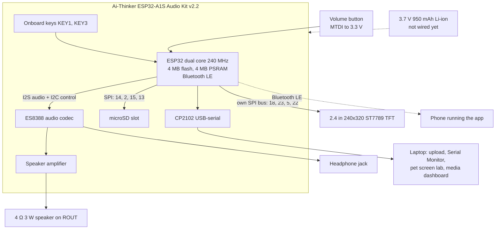

# Electronics: the pet

The pet is built on an off-the-shelf audio board with parts wired to its headers; there's no
custom PCB yet. Licence: CERN-OHL-S-2.0 (see [LICENSE.md](../LICENSE.md)).

The working source of truth for wiring is
[Code/pif-webapp/firmware/WIRING.md](../Code/pif-webapp/firmware/WIRING.md), and the board
findings (what we verified, what bit us) are in
[Code/pif-webapp/HARDWARE.md](../Code/pif-webapp/HARDWARE.md). This page is the overview.

## Block diagram

## Display: 2.4" ST7789 TFT, 240×320

| Display pin | Board pin | GPIO | Notes |
|---|---|---|---|
| VCC | 3.3 V | | |
| GND | GND | | |
| LED | 3.3 V | | backlight, always on |
| SCK | IO18 | 18 | its own SPI bus (HSPI), 20 MHz |
| SDI / MOSI | IO23 | 23 | |
| CS | IO5 | 5 | |
| DC | IO22 | 22 | also the onboard LED, which flickers: harmless |
| RESET | EN / RST | | resets with the board |
| SDO / MISO | not connected | | |

Keep the display **off GPIO 13, 14 and 15**: those are the SD card's lines, and sharing them
made the card unreadable.

## Buttons

| Button | Where | GPIO | Wiring | Job |
|---|---|---|---|---|
| KEY1 | onboard | 36 | external button optional, across its legs | **power**: hold 2 s to sleep, press to wake |
| KEY3 | onboard | 19 | external button optional, across its legs | **story**: tap pause/play, double-tap skip, hold replay |
| MTDI | JTAG header | 12 | button between MTDI and **3.3 V** (not GND) | **volume**: tap up, hold down |

GPIO 12 sets the flash voltage at boot and must be LOW then, so this button pulls it **up**
when pressed (the firmware holds it down otherwise). Don't hold it while powering on.

## Audio

| Part | Where |
|---|---|
| Speaker, 4 Ω 3 W | ROUT + and − (polarity doesn't change the sound) |
| Earphones | the headphone jack; the board mutes the speaker while anything is plugged in |

Speaker amplifier enable is GPIO 21 (driven by the firmware). Volume 0.9 is 0 dB on this codec;
above it the speaker distorts.

## SD card

FAT32, in the onboard slot. `stories/` holds the story WAVs (16-bit PCM, mono, 22050 Hz);
`media/` holds videos (`.mjpeg` + `.wav` + `.cfg`).

**DIP switches: 1 OFF, 2 ON, 3 ON, 4 OFF, 5 OFF.**

| Switch | Connects | Setting |
|---|---|---|
| 1 | GPIO 13 ↔ KEY2 | off: keeps the key off the card's chip-select |
| 2 | GPIO 13 ↔ SD DATA3 (chip-select) | on |
| 3 | GPIO 15 ↔ SD CMD | on |
| 4 | GPIO 13 ↔ JTAG MTCK | off |
| 5 | GPIO 15 ↔ JTAG MTDO | off |

## Pin budget

Every pin the board brings out, and what it does now:

| GPIO | Used for |
|---|---|
| 0, 25, 26, 27, 35 | I2S audio to the codec (0 is also the boot pin) |
| 32, 33 | codec control (I2C), not on the headers |
| 2, 13, 14, 15 | SD card |
| 5, 18, 22, 23 | display |
| 12 | volume button (MTDI) |
| 19, 36 | KEY3, KEY1 |
| 21 | speaker amplifier enable |
| 39 | headphone detect |
| 1, 3 | USB serial (Serial Monitor, lab, uploads) |

Nothing useful is left: no free analog pin (so no potentiometer), no free touch pin. More
inputs would need an I2C GPIO expander (an MCP23017, not the output-only PCA9685 we have).

## Power

USB powers it for now. The 3.7 V 950 mAh Li-ion cell goes on the board's battery connector,
with a **slide switch on its + wire** for a real off: the firmware's sleep (hold KEY1) still
leaves the codec, amplifier and backlight powered.

## Parts

See [BOM.csv](../BOM.csv).
