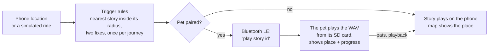
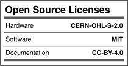

# MAKER'S ASYLUM + KULFI Play it Forward (PiF) Partnership
## 2026 Week 40 COHORT 06
## Team : SUBWAY SURFERS

# Jam: stories of the places you pass

> *We cross paths with thousands of people and hundreds of places every day, and know almost
> nothing about any of them.*

**Jam** is a location-triggered story app for Mumbai commuters, made by Team Subway Surfers
during the Play it Forward residency. As you travel a
train corridor, it notices the places you're passing and plays a short story about each one:
what was there before the road, what happened there, what everyone walks past every day.

It comes with an optional companion, **the pet**: a small object you carry, built on an
ESP32 audio board with a colour screen, a speaker and an SD card. It pairs with the phone over
Bluetooth, plays the stories itself, shows where you are, and has a face that reacts to you.

How we got here (fieldwork, the genre's graveyard, the reversals): [Documentation/RESEARCH.md](Documentation/RESEARCH.md)
and [Documentation/ENGINEERING-LOG.md](Documentation/ENGINEERING-LOG.md).

It's quiet and specific on purpose. The subject is a city people have stopped noticing, so
there are no points, streaks, profiles or feeds.

---

## How it works



1. **Start journey** (a tap) unlocks audio, keeps the screen awake and starts location. The web
   can't track location in the background, so it's a travel mode you switch on, like a music
   player.
2. Each location fix is checked against every story's place and radius. A story fires **once
   per journey**, needs **two fixes inside its radius** (or one accurate fix) so a bad GPS fix
   on a moving train can't fire it early, and the nearest one wins.
3. The story plays on the phone, or on the pet if one is paired. **Audio never crosses the
   Bluetooth link** (the pet has the files on its SD card; the phone sends an id), and **the
   pet never sees coordinates** (it's told the conclusion, not the input).
4. For a showcase in a room with no train, the stories' places can be marked on site ("Mark
   here") with small radii, and walked as a real GPS journey; or a simulated ride drives the
   same trigger logic.

## The parts

| | What | Where |
|---|---|---|
| 📱 | **The app** (web, installable): map-first visitor app at `/`, test tool at `/debug` | [`Code/pif-webapp`](Code/pif-webapp) |
| 🐣 | **The pet's firmware** (Arduino, ESP32): stories, face and moods, buttons, Bluetooth, video | [`Code/pif-webapp/firmware`](Code/pif-webapp/firmware) |
| 🧪 | **Pet screen lab** (`/lab`): design the pet's screens, see them live on the real screen over USB | [`Code/pif-webapp/src/lab`](Code/pif-webapp/src/lab) |
| 🎞️ | **Pet media** (`/media`): put videos and animations on the pet's SD card and play them | same |
| 🖥️ | **TFT Web Lab** (`Local_Host`): a standalone browser tool to drive the screen over USB | [`Code/Local_Host`](Code/Local_Host) |
| 🔌 | **Electronics**: every wire, the pin budget, the DIP switches | [`Electronics`](Electronics) |
| 📚 | **Documentation**: how to use everything, design decisions, what we learned | [`Documentation`](Documentation) |

## Quick start

**The app** (needs [Node.js](https://nodejs.org) 20+):

```sh
cd Code/pif-webapp
npm install
npm run dev          # http://localhost:5173  (also /debug, /lab, /media)
npm run dev:phone    # HTTPS on your Wi-Fi, for real GPS on a phone
```

**The pet**: Arduino IDE, board **ESP32 Wrover Module**, partition **Huge APP**, libraries from
the Library Manager (NimBLE-Arduino, Adafruit ST7735 and ST7789, Adafruit GFX, JPEGDEC) plus
Phil Schatzmann's `arduino-audio-tools` and `arduino-audio-driver` (from GitHub). Upload
`Code/pif-webapp/firmware/pet_story_player`, open the Serial Monitor at **921600** baud and type
`help`. Step-by-step bring-up: [firmware/README.md](Code/pif-webapp/firmware/README.md); wiring:
[firmware/WIRING.md](Code/pif-webapp/firmware/WIRING.md).

## What's in each folder

| Folder | Contents |
|---|---|
| [`Code/`](Code) | All software. `pif-webapp/` is the app, the pet's firmware, the lab and media tools, and the converter scripts. `Local_Host/` is the standalone TFT Web Lab. See [Code/README.md](Code/README.md). |
| [`Electronics/`](Electronics) | Block diagram, pin map, wiring, DIP switches, buttons, power. |
| [`CAD/`](CAD) | The pet's enclosure: base and front (STL), work in progress. |
| [`Documentation/`](Documentation) | How it works and guides for every part; the [engineering log](Documentation/ENGINEERING-LOG.md), [research](Documentation/RESEARCH.md), [decisions](Documentation/DECISIONS.md), [platform constraints](Documentation/PLATFORM-CONSTRAINTS.md), [troubleshooting](Documentation/TROUBLESHOOTING.md) and [open questions](Documentation/OPEN-QUESTIONS.md). |
| [`Photos_Videos/`](Photos_Videos) | Prototype photos and videos; the pet's face animation frames (`Images/Animation.zip`). |
| [`Reference_Data/`](Reference_Data) | Datasheets, libraries and web specs we relied on. |
| [`BOM.csv`](BOM.csv) | Bill of materials. |
| [`LICENSE.md`](LICENSE.md) | Licences, and the third-party parts we use. |

## Status (October 2026)

| | |
|---|---|
| ✅ | App: real GPS and simulated journeys, trigger rules, map, stories on the phone, pairing with the pet (with automatic reconnect) |
| ✅ | Pet: plays stories from its SD card when the app says so, shows place and progress, face with seven moods, three buttons (power/sleep, story, volume) |
| ✅ | Pet screen lab with live mirroring to the real screen; media dashboard |
| 🔧 | Video from the SD card with sound: built, being tried on the board |
| 🔧 | Portrait screen designs: drafted in the lab, to be ported to the firmware |
| 🔧 | The enclosure: base and front modelled (`CAD/`) |
| ⏳ | Real stories (text, recordings, sources), battery and power switch |

Details and open decisions: [Documentation/README.md](Documentation/README.md) and
[docs/FEATURES.md](Code/pif-webapp/docs/FEATURES.md).

## License

Licenses

<a href="LICENSE.md"></a>

#### Hardware
CERN Open Hardware License Version 2 - Strongly Reciprocal ([CERN-OHL-S-2.0](https://spdx.org/licenses/CERN-OHL-S-2.0.html)).

#### Software
MIT open source [license](http://opensource.org/licenses/MIT).

#### Documentation:
<a rel="license" href="http://creativecommons.org/licenses/by/4.0/"></a><br />This work is licensed under a <a rel="license" href="http://creativecommons.org/licenses/by/4.0/">Creative Commons Attribution 4.0 International License</a>.

Third-party libraries, fonts and map data keep their own licences: see [LICENSE.md](LICENSE.md).

---

## 📬 Contact/Team

**Team Subway Surfers:** Gayatri Sapre, Avantika Rikhye, Aarya Rokade

**Mentor:** Kushal

[@anool](https://github.com/Anool)

---
